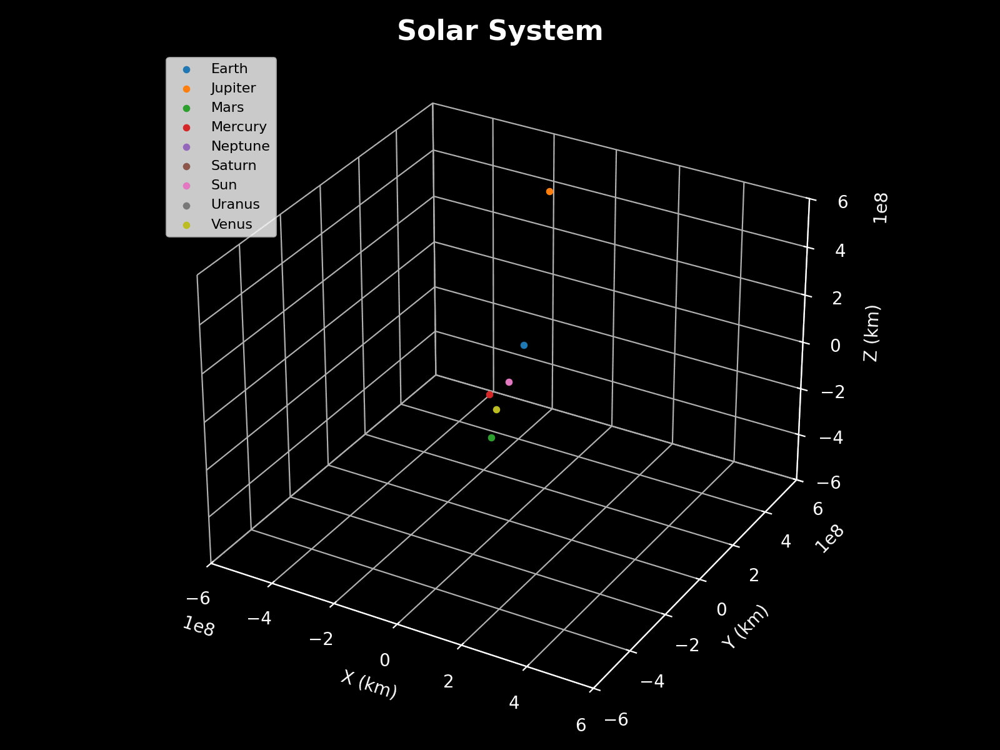

# N-Body Simulation in Python

A 3D N-body gravitational simulation built in Python that models celestial mechanics using **Verlet integration** and **collision merging**.

## Features
- Simulates gravitational interactions between objects.
- Options to:
  1. Generate a **manual system** (custom objects).
  2. Load a **predefined solar system**.
  3. Create a **random star cluster**.
- Handles **collisions and merges objects** based on momentum conservation.
- Saves simulation data for playback and analysis.
- Includes 3D animated visualization using `matplotlib`.

---
## Demos

### Solar System Simulation


### Star Cluster Simulation


### 3 Body Chaotic simulation


## How to simulate 
- Run the main.py file and choose one of the three options
- Simulation will be saved in a .npy file
- Run animation.py file to view your simulation

## Features
- Uses **Newton's law of gravitation** to compute pairwise forces.
- Integrates motion using **Velocity Verlet** for stability.
- **Collision merging** conserves momentum and uses center of mass.
- Snapshots are saved every few steps for visualization.

## Performance
- Current complexity: **O(N²)** (slows for >50 objects).
- Planned: Implement **Barnes-Hut algorithm** for large clusters.

## Future Work
- Better integrator to improve accuracy 
- Barnes-Hut algorithm to simulate galaxies
- GUI for simulation control 

## License
This project is licensed under the MIT License.

## Author
Made by [Nakul Suthar](https://github.com/Nakulsuthar)

## Installation
Clone this repository and install dependencies:
```bash
git clone https://github.com/Nakulsuthar/N-body-simulation.git
cd n-body-simulation
pip install -r requirements.txt

